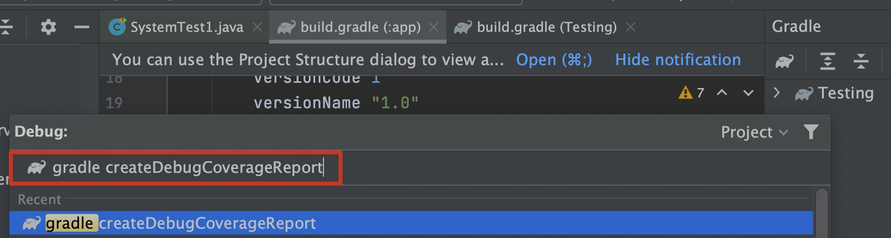
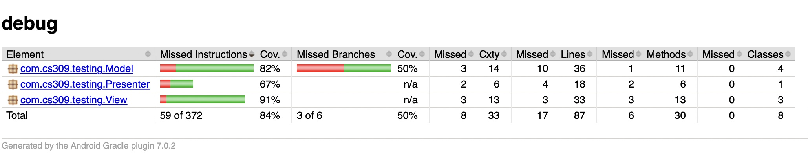

SpringBoot version 2.4.0
JAVA JDK version 11
Android compileSdkVersion 29

# Unit testing examples

## Which files for system tests

Backend: Backend->testing->src->test->java->myapp->TestingSystemTest.java

Frontend: Testing->app->src->androidTest->java->com->cs309->testing->SystemTest1.java

## Note

In order for frontend tests to pass, you will need to have the backend running at the same time

## Frontend Coverage Report

1. add to your `build.gradle(Module: app)` (inside buildTypes)
```
debug{
    testCoverageEnabled true
}
```
so that it looks like this 
```
 buildTypes {
    debug{
        testCoverageEnabled true
    }

    ... (other things)
}
```

2. click on `sync now` to update the project

3. make sure you have your Android enmulator up and running

4. in Android Studio, open Gradle tab on the right, hit the 'Gradle icon' to type in commands


5. type in `createDebugCoverageReport` and hit 'Enter'



6. once it runs through, find the coverage report in: `/tutorials/Frontend/Testing/app/build/reports/coverage/androidTest/debug/index.html`

7. it should look something like:




